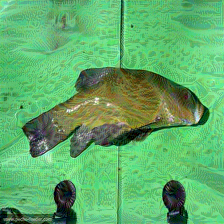
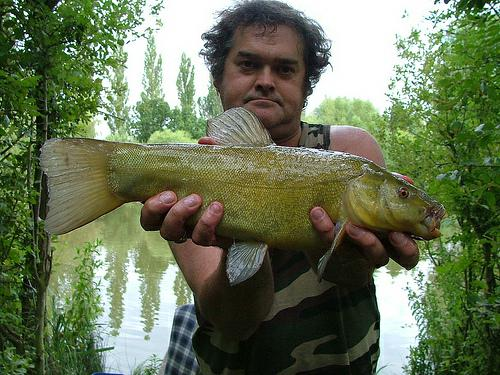
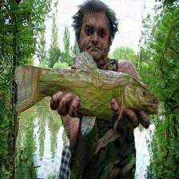
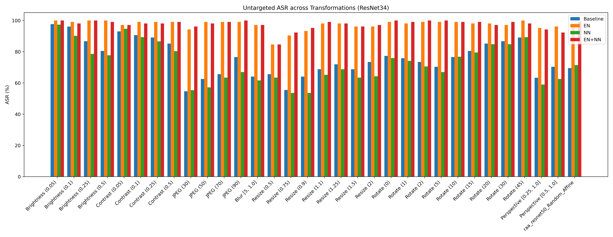
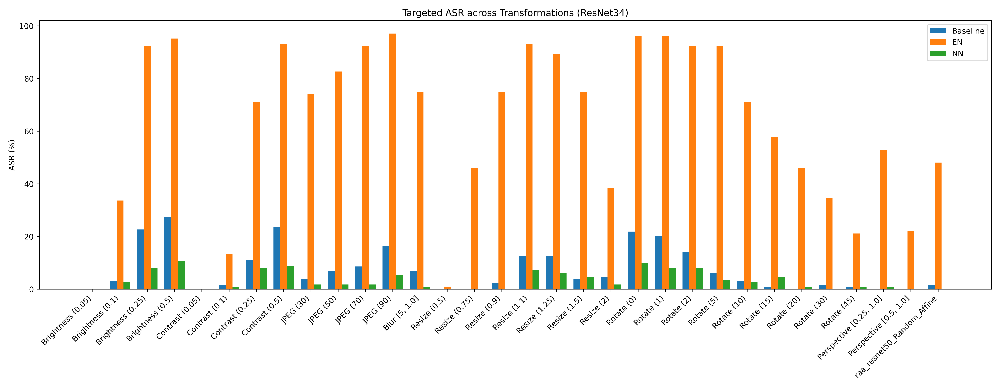

# ADE-IGSA

Adaptive Disturbance & Ensemble Optimization for Robust Adversarial Attacks.

Extension of IGSA for improved robustness under real-world transformations and better black-box transferability.

## Links

- Report (Detailed Explanation): https://drive.google.com/file/d/1j4gjoC4eg_PkqbtvbhSnrubz7fJXaMZK/view?usp=sharing
- Source Repo (IGSA): https://github.com/nimingck/IGSA

## Overview

Deep neural networks are highly vulnerable to adversarial examples, but most attacks fail under real-world transformations (blur, resize, compression, etc.).

This project builds upon IGSA (Inverse Gradient Sampling Attack) and introduces:

### Key Contributions

- Adaptive Disturbance Modeling (DisturbanceNet)
- Ensemble-based Optimization (EN)
- Improved transferability across models
- Robustness under transformations

## Method Summary

The attack optimizes perturbation $\delta$ such that:

$x + \delta$ fools the model under disturbances.

### Core Idea

- Sample disturbances to push perturbation toward worst-case directions (IGS)
- Then learn a perturbation that overcomes this worst direction
- Learn disturbance mapping via DisturbanceNet
- Optimize across multiple models (ensemble)

## Experimental Setup

- Dataset: ImageNet subset (100 images)
- White-box: ResNet50
- Black-box: ResNet34, MobileNetV3, ViT
- Ensemble: VGG19, DenseNet121, Efficientnet_b0, Swin_t

## Transformations

- Brightness / Contrast
- JPEG Compression
- Gaussian Blur
- Rotation
- Resize
- Perspective / Affine

## Runtime

| Method | Time |
| --- | --- |
| IGSA | ~24 min |
| + NN | ~43 min |
| + EN | ~175 min |
| EN+NN | ~247 min |

## Repository Structure

```text
ADE-IGSA/
|-- IGSA.py
|-- Transform.py
|-- data/
|-- results/
`-- README.md
```

## Usage

Install dependencies:

```bash
pip install torch torchvision timm pandas tqdm
```

Run:

```bash
python IGSA.py --input_dir {dataset folder} --output_dir {output_folder} --ensemble --nn --targeted
```

If using targeted, input_dir must contain a csv with columns `filename`, `label` and `targeted_label`
## Flags

- `--ensemble`: Enable ensemble
- `--nn`: Enable disturbance net
- `--targeted`: Targeted attack
- `--save_all`: Save all perturbed images
- `max_test_num`: Set Images to be tested

## Output

- Images: `{output_folder}/imgs`
- Metrics:
    - `results_eval.txt` (ASR under transformation)
    - `results_eval.json` (actual labels logs)

## Original vs Perturbed Samples

### Pair 1

| Original | Perturbed |
| --- | --- |
|  |  |

### Pair 2

| Original | Perturbed |
| --- | --- |
|  |  |

## Graphs
### Untargeted Results Under Transformations



### Targeted Results Under Transformations



## Limitations

- High compute cost
- NN unstable
- Sensitive to hyperparameters
- Targeted transfer still hard

## Future Work

- Improve DisturbanceNet
- Reduce compute

